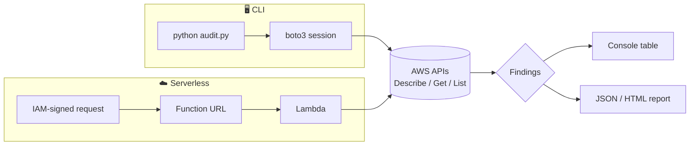

<div align="center">

# 🛡️ AWS Security Audit

[](https://github.com/ArnavGarg2006/AWS-Security-Audit)


A read-only Python/boto3 CLI (plus a serverless twin) that scans an AWS account for
common security misconfigurations. Every API call it makes is a `Describe*`, `Get*`,
or `List*` — it can't change anything if it tried.

</div>

<br>

<div align="center">
  
  <br>
  <sub>One pass, one hop per service — the pulse restarts from IAM every time this page loads.</sub>
</div>

<br>

## Severity, at a glance

 internet-exposed or wide-open — fix now
 meaningful exposure — fix soon
 best-practice gap
 minor hardening

## What it checks

| Service | Checks |
|---|---|
| **IAM** 🔑 | Root MFA / root access keys, account password policy, users with console access but no MFA, access keys older than 90 days, unused access keys, customer-managed policies granting `*:*` |
| **S3** 🪣 | Block Public Access settings, public bucket policy, public ACL grants, default encryption, versioning, access logging |
| **EC2** 🖥️ | Security groups open to `0.0.0.0/0`/`::/0` (flags sensitive ports — SSH/RDP/DB — as CRITICAL), unencrypted EBS volumes, instances with public IPs, presence of a default VPC |
| **RDS** 🗄️ | Publicly accessible instances, unencrypted storage, disabled automated backups, Multi-AZ, auto minor-version upgrades |
| **CloudTrail / Config / GuardDuty** 📜⚙️🛡️ | Missing multi-region trail, trail not logging, log file validation, log encryption, Config recorder status, GuardDuty detector status |

Every finding carries a severity, the exact resource, and a specific remediation step —
not just "this is bad," but what to run or click to fix it.

## Quickstart

```bash
pip install -r requirements.txt

# aws configure  (or env vars / SSO / instance role — your call)

python audit.py --json-out report.json --html-out report.html
```

Needs the AWS-managed **`SecurityAudit`** or **`ReadOnlyAccess`** policy attached to
whatever identity you run it as. Exit code is `1` if anything CRITICAL/HIGH turned up
(handy in CI), `0` if clean, `2` on a setup/auth problem.

<details>
<summary><strong>Full CLI reference</strong></summary>

```
python audit.py [options]

--profile PROFILE     AWS named profile to use
--region REGION       Region to scan (repeatable)
--all-regions         Scan all enabled EC2 regions
--services SERVICES   Comma-separated subset: iam, s3, ec2, rds, logging
--json-out PATH       Write a full JSON report
--html-out PATH       Write a self-contained HTML report
--no-console          Suppress the console table
```

```bash
python audit.py --profile prod --region us-east-1 --region eu-west-1
python audit.py --all-regions
python audit.py --services iam,s3
```

</details>

## Two ways to run it



The [CLI](aws_security_audit/) is the tool itself. The
[Lambda web app](lambda-s3-audit-webapp/) runs the same checks behind an
IAM-authenticated Function URL — same logic, on-demand, no local Python needed.

<details>
<summary><strong>Project layout</strong></summary>

```
aws_security_audit/
  cli.py                  argument parsing + orchestration
  models.py                Finding / AuditResult data model
  report.py                console (rich), JSON, and HTML renderers
  checks/
    iam.py
    s3.py
    ec2.py
    rds.py
    logging_monitoring.py  CloudTrail / Config / GuardDuty
audit.py                   entry point: `python audit.py`
```

Each `checks/*.py` module exposes `get_checks(session, region)` returning a list of
`(check_id, description, region, callable)` tuples. The CLI runs each callable
independently and catches exceptions per-check, so a missing permission on one check
(e.g. no `guardduty:ListDetectors`) is reported as a skipped check rather than crashing
the whole audit.

</details>

## Extending

Add a function to the relevant `checks/*.py` module that returns a list of `Finding`
objects, then register it in that module's `CHECKS` list (or `REGIONAL_CHECKS`/global
helper for `logging_monitoring.py`).

## Also in this repo

- 🌩️ [**lambda-s3-audit-webapp/**](lambda-s3-audit-webapp/) — the same audit logic as a
  Lambda function behind an IAM-authenticated Function URL
- 📬 [**fullstack-contact-app/**](fullstack-contact-app/) — a separate demo built while
  exploring this same account, grown into a small production-shaped stack: DynamoDB
  persistence, SNS/SES notifications, a WAF rate limit + CORS lockdown + IAM
  least-privilege throughout, CloudWatch alarms, X-Ray tracing, an AWS SAM template for
  reproducible deploys, and a GitHub Actions pipeline deploying with its own
  scoped-down IAM user (not the admin credentials used interactively)

<div align="center">
<sub>Built to answer "what's actually wrong with my AWS account" — not to guess.</sub>
</div>
