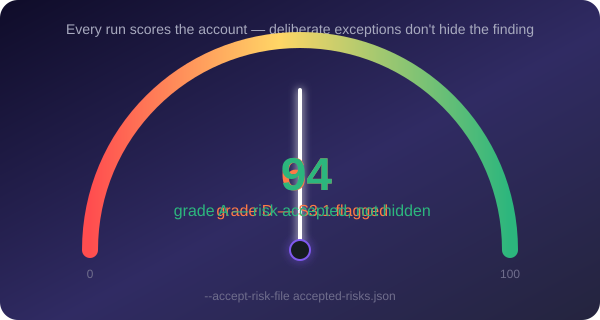
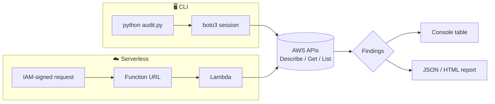

<div align="center">

# 🛡️ AWS Security Audit

[](https://github.com/ArnavGarg2006/AWS-Security-Audit)


A read-only Python/boto3 CLI (plus a serverless twin) that scans an AWS account for
common security misconfigurations. Every API call it makes is a `Describe*`, `Get*`,
or `List*` — it can't change anything if it tried.

</div>

<br>

<div align="center">
  
  <br>
  <sub>One pass, one hop per service — the pulse restarts from IAM every time this page loads.</sub>
</div>

<br>

## Severity, at a glance

 internet-exposed or wide-open — fix now
 meaningful exposure — fix soon
 best-practice gap
 minor hardening

## What it checks

| Service | Checks |
|---|---|
| **IAM** 🔑 | Root MFA / root access keys, account password policy, users with console access but no MFA, access keys older than 90 days, unused access keys, customer-managed policies granting `*:*` |
| **S3** 🪣 | Block Public Access settings, public bucket policy, public ACL grants, default encryption, versioning, access logging |
| **EC2** 🖥️ | Security groups open to `0.0.0.0/0`/`::/0` (flags sensitive ports — SSH/RDP/DB — as CRITICAL), unencrypted EBS volumes, instances with public IPs, presence of a default VPC |
| **RDS** 🗄️ | Publicly accessible instances, unencrypted storage, disabled automated backups, Multi-AZ, auto minor-version upgrades |
| **CloudTrail / Config / GuardDuty** 📜⚙️🛡️ | Missing multi-region trail, trail not logging, log file validation, log encryption, Config recorder status, GuardDuty detector status |

Every finding carries a severity, the exact resource, and a specific remediation step —
not just "this is bad," but what to run or click to fix it.

## Quickstart

Requires the [AWS CLI](https://aws.amazon.com/cli/) (v2) for `aws configure` and any
manual deployment steps in this repo — `boto3` (bundled by `requirements.txt`) handles
the actual API calls the audit makes, but the CLI is how you set up the credentials it
reads.

```bash
pip install -r requirements.txt

aws configure   # or env vars / SSO / instance role — your call

python audit.py --json-out report.json --html-out report.html
```

Needs the AWS-managed **`SecurityAudit`** or **`ReadOnlyAccess`** policy attached to
whatever identity you run it as. Exit code is `1` if anything CRITICAL/HIGH turned up
(handy in CI), `0` if clean, `2` on a setup/auth problem.

Every run also prints a **0-100 security score and letter grade** (Mozilla Observatory /
SSL Labs style) with the findings costing you the most points — a different audience's
entry point than the full table. A generic check can't know a public S3 bucket is a
deliberate static-website bucket vs. a real misconfiguration, so deliberate exceptions are
supported without hiding the finding from the report:

```bash
python audit.py --accept-risk-file accepted-risks.json
```

```json
[{"check_id": "S3.1", "resource": "my-bucket", "reason": "intentional - static website hosting", "expires": "2027-03-01"}]
```

`expires` is optional but recommended: an expired entry falls back into the score (with a
warning printed) instead of a deliberate exception silently becoming a permanent blind spot.

<div align="center">
  
</div>

Two more opt-in flags round out the score/fix loop: `--history-file PATH` appends every
run's score/grade/finding-counts to a small JSON file and prints the trend against the
previous run (so a regression — "this was a 94 last week, it's a 74 now" — shows up in the
console output itself), and `--fix-script PATH` writes a shell script of ready-to-run AWS
CLI commands for every finding that maps to one, with the finding's own resource/region
substituted in. Neither is ever executed automatically; `--fix-script` also respects
`--accept-risk-file` and skips generating a "fix" for anything already deliberately
accepted.

<details>
<summary><strong>Full CLI reference</strong></summary>

```
python audit.py [options]

--profile PROFILE     AWS named profile to use
--region REGION       Region to scan (repeatable)
--all-regions         Scan all enabled EC2 regions
--services SERVICES   Comma-separated subset: iam, s3, ec2, rds, logging
--json-out PATH       Write a full JSON report
--html-out PATH       Write a self-contained HTML report
--no-console          Suppress the console table
--accept-risk-file PATH   JSON file of findings to exclude from the score (still
                          shown in the full report — see above)
--history-file PATH   Append this run's score/grade to a JSON history file
                       and print the trend vs. the previous run
--fix-script PATH     Write ready-to-run AWS CLI remediation commands for
                       every findable check_id (never executed automatically)
```

```bash
python audit.py --profile prod --region us-east-1 --region eu-west-1
python audit.py --all-regions
python audit.py --services iam,s3
```

</details>

## Two ways to run it


```mermaid
flowchart LR
    subgraph CLI["🖥️ CLI"]
        A[python audit.py] --> B[boto3 session]
    end
    subgraph Lambda["☁️ Serverless"]
        C[IAM-signed request] --> D[Function URL] --> E[Lambda]
    end
    B --> F[(AWS APIs<br/>Describe / Get / List)]
    E --> F
    F --> G{Findings}
    G --> H[Console table]
    G --> I[JSON / HTML report]
```

The [CLI](aws_security_audit/) is the tool itself. The
[Lambda web app](lambda-s3-audit-webapp/) runs the same checks behind an
IAM-authenticated Function URL — same logic, on-demand, no local Python needed.

<details>
<summary><strong>Project layout</strong></summary>

```
aws_security_audit/
  cli.py                  argument parsing + orchestration
  models.py                Finding / AuditResult data model
  report.py                console (rich), JSON, and HTML renderers
  checks/
    iam.py
    s3.py
    ec2.py
    rds.py
    logging_monitoring.py  CloudTrail / Config / GuardDuty
audit.py                   entry point: `python audit.py`
```

Each `checks/*.py` module exposes `get_checks(session, region)` returning a list of
`(check_id, description, region, callable)` tuples. The CLI runs each callable
independently and catches exceptions per-check, so a missing permission on one check
(e.g. no `guardduty:ListDetectors`) is reported as a skipped check rather than crashing
the whole audit.

</details>

## Extending

Add a function to the relevant `checks/*.py` module that returns a list of `Finding`
objects, then register it in that module's `CHECKS` list (or `REGIONAL_CHECKS`/global
helper for `logging_monitoring.py`).

## Continuous verification

A finding says "this is misconfigured" based on a config API response. That's not the
same as proving the hole is actually exploitable — or, after a fix, that it's actually
closed. [`verify_findings.py`](verify_findings.py) actively re-attempts the exploit path
for the finding types where that's meaningful, instead of re-reading the same config:

```bash
python verify_findings.py report.json
```

- **S3 public-access findings** — makes real, unauthenticated HTTPS requests against the
  bucket (both `ListBucket` and `GetObject` — a bucket can correctly deny one while still
  serving the other, which the first version of this tool got wrong and reported as
  falsely "closed" until fixed)
- **EC2 open-security-group findings** — re-fetches the *current* live security group and
  re-runs [`sg-firewall-simulator`](sg-firewall-simulator/)'s real CIDR-containment logic
  against it, not a cached finding
- **RDS public-accessibility findings** — a real TCP connection attempt to the instance's
  live endpoint/port, since a security group can block everything even with
  `PubliclyAccessible=true` set
- **IAM no-MFA findings** — re-lists the user's MFA devices right now via
  `list_mfa_devices`, instead of trusting the credential report snapshot (which AWS
  refreshes on its own internal schedule, not on request)

## Reasoning about reachability, not just listing findings

A flat findings list can't tell you that two separate LOW/MEDIUM items compound into
something worse. [`attack-path-graph/`](attack-path-graph/) builds an actual graph of
IAM trust, resource policies, and network exposure, and asks "what can be *reached*
from the internet" — separately from "what's misconfigured but unreachable."

<div align="center">
  
</div>

Run against this account, it correctly finds **no automated path** from the internet to
full compromise — but separately flags that `Arnav@2006` has `AdministratorAccess`
attached directly, and that `s3-audit-lambda-role`'s `ReadOnlyAccess` reaches every
bucket in the account. Neither of those needed a network path to matter; the graph
reports them as their own class of finding instead of burying them in a checklist.

## Vulnerability intelligence: public data, not just AWS config

Everything above answers "is this misconfigured." [`vuln-intel/`](vuln-intel/) asks a
different question: is the *software actually running* — this account's real Lambda
runtimes and its real pinned `package-lock.json` — affected by a published CVE at all.
Two public sources for two different questions: NVD (CPE version-range match) for "is
this runtime's language version affected," OSV.dev (npm-native batch query) for "does
this exact pinned dependency version have a known vulnerability."

<div align="center">
  
</div>

Building it caught a real false-positive mechanism in NVD's own API before it shipped: a
precise CPE version-range match still returned a CVE that was actually about **Odoo**,
because NVD lists Python 3.6+ as a `vulnerable: False` "runs on" context for it with an
open-ended range that sweeps in every future Python release. Filtering to only
`vulnerable: True` matches dropped `nodejs20.x` from 6 spurious CVEs to 0, and
`python3.13` from 22 to 18 genuine ones.

## Also in this repo

Everything below runs against the same real AWS account this audit tool scans — no
sandbox data, no invented findings.

<div align="center">
  
</div>

| Project | What it does | Verified outcome |
|---|---|---|
| 🌩️ [**lambda-s3-audit-webapp/**](lambda-s3-audit-webapp/) | Same audit logic behind an IAM-authenticated Lambda Function URL | Live, returns HTML/JSON on demand |
| 📬 [**fullstack-contact-app/**](fullstack-contact-app/) | Contact form grown into a production-shaped stack: DynamoDB, SNS/SES, WAF, CloudWatch alarms, X-Ray, an AWS SAM template, and a GitHub Actions pipeline with its own scoped-down IAM user | Live end-to-end; first CI-driven deploy succeeded on the first real push |
| 🔎 [**webapp-vuln-scanner/**](webapp-vuln-scanner/) | Headers/CORS/injection/rate-limit scanner, run against `fullstack-contact-app` | **12 → 7 findings** after fixes; chasing its own false negatives surfaced a real account-level Lambda concurrency quota (10, vs AWS's default 1000) |
| 🕸️ [**attack-path-graph/**](attack-path-graph/) | Graphs IAM/S3/Lambda relationships (now backed by AWS's real policy simulator, not heuristics) and simulates per-principal blast radius, to answer "what can actually be reached, and what would it be worth" | Ground-truth simulation found the account's admin user holds admin via **3 independent policies**, not the 1 the old heuristic checked by name; blast-radius simulation found `s3-audit-lambda-role` can also read DynamoDB/SSM/logs, not just S3 |
| 🌊 [**iac-drift-detector/**](iac-drift-detector/) | Diffs `template.yaml`'s declared state against live resources and attributes any drift to the real CloudTrail event/principal that caused it — no CloudFormation stack exists to run native drift detection against, since these were hand-deployed | Verified both directions: clean on the real stack, then caught a deliberately-introduced real config change (Lambda memory 128→256MB) and correctly attributed it to the real user/timestamp — after fixing a bug where Lambda's versioned CloudTrail event names silently broke the lookup |
| 💸 [**cost-of-insecurity/**](cost-of-insecurity/) | Reframes findings in dollars: bounded normal cost vs. unbounded exploited-cost liability | Caught and fixed a real bug in itself (wrong CloudWatch region + an oversized query window silently swallowed by a broad `except`) before reporting the real bucket size |
| 🚦 [**shift-left-scanner/**](shift-left-scanner/) | Scans `template.yaml` for misconfigurations *before* deployment, wired into the GitHub Actions pipeline as a gate `deploy` now depends on | Verified against both the real (1 known finding) and a deliberately broken (6 findings, 5 blocking) template |
| 🧬 [**s3-integrity-monitor/**](s3-integrity-monitor/) | S3 Event Notifications → Lambda → DynamoDB → SNS, watching the CloudTrail log bucket for tampering | Verified live: create (silent) → overwrite (HIGH alert) → delete (CRITICAL alert) |
| 🧱 [**sg-firewall-simulator/**](sg-firewall-simulator/) | Evaluates simulated packets against real security group rules, not an invented rule set | Verified both directions: current account shows 0 exposures; a throwaway open-SSH group was correctly flagged, then deleted |
| 🦠 [**vuln-intel/**](vuln-intel/) | Cross-references deployed Lambda runtimes (NVD) and pinned npm dependencies (OSV.dev) against real public CVE data | Caught a real NVD false-positive mechanism live — a CVE actually about Odoo was matching Python 3.13 via an open-ended "runs on" context — and fixed it before shipping; 311 real pinned dependencies scanned clean |

<div align="center">
<sub>Built to answer "what's actually wrong with my AWS account" — not to guess.</sub>
</div>
