# Full-Stack Contact Form (Lambda + API Gateway + DynamoDB + SNS + SES)

<div align="center">
   WAF -> API Gateway -> Lambda -> DynamoDB, with SNS and SES firing as async side effects" width="100%">
  <br>
  <sub>DynamoDB write blocks the response · SNS + SES fire in parallel as best-effort side effects</sub>
</div>

<br>

A public contact form, backed by a Lambda function, that actually does something with what
it collects: persists it, notifies you, and (where SES allows) confirms it to the sender —
hardened against abuse and instrumented enough to debug when something breaks.

## Live deployment

| Component | Value |
|---|---|
| Frontend | http://contact-form-frontend-653011867129-ap-south-1.s3-website.ap-south-1.amazonaws.com |
| `POST /contact` | `https://bv2wjj78b0.execute-api.ap-south-1.amazonaws.com/prod/contact` |
| `GET /submissions` | `https://bv2wjj78b0.execute-api.ap-south-1.amazonaws.com/prod/submissions` |
| Lambda | `contact-form-handler`, Node.js 20.x, `ap-south-1` |
| Storage | DynamoDB `contact-form-submissions` (pay-per-request, encrypted) |

**Hosting note:** the original design calls for S3 + CloudFront. This AWS account still
returns `AccessDenied: Your account must be verified before you can add new CloudFront
resources` on `CreateDistribution` — an account-level gate needing an AWS Support ticket,
not a config issue. Served via S3 static website hosting instead; see `template.yaml` for
the CloudFront-ready IaC definition to swap in once that clears.

## What it does

1. **Frontend** — a single page with two tabs: submit the form, or browse recent
   submissions (emails masked, e.g. `ar***@example.com`).
2. **API Gateway** — `POST /contact` and `GET /submissions`, both behind a WAF rate limit
   and stage-level throttling, CORS restricted to the real frontend origin (not `*`).
3. **Lambda** validates input, then:
   - **writes to DynamoDB** (blocking — the response waits for this to confirm persistence)
   - **publishes to SNS** and **sends an SES confirmation email** in parallel
     (`Promise.all`, best-effort — neither failure blocks the response)
4. **CloudWatch alarms** on Lambda errors and p99 duration notify the same SNS topic.
5. **X-Ray** traces every request end-to-end (API Gateway → Lambda → DynamoDB/SNS/SES).

## Security hardening

| Control | Detail |
|---|---|
| CORS | `Access-Control-Allow-Origin` is the exact S3 site origin, not `*` |
| WAF | Regional Web ACL, rate-based rule: 300 requests / 5 min per source IP, blocks over the limit |
| Throttling | API Gateway stage-level: 10 req/s steady, burst 20 — caps aggregate cost regardless of source |
| IAM | Lambda's role grants only `dynamodb:PutItem`/`Query` on the one table, `sns:Publish` on the one topic, and `ses:SendEmail` conditioned on the specific verified `FromAddress` — no wildcard actions |
| CI credentials | GitHub Actions uses a **separate, scoped-down IAM user** (`contact-form-ci`: Lambda code deploy + S3 sync only) — never the admin credentials used for interactive development |

**Not done, and why:** reCAPTCHA/hCaptcha would need a Google account to register a site
key — that's yours to set up, not something I can provision. A custom domain (Route 53 +
ACM) needs a domain name you own, which wasn't provided; `AllowedOrigin` and CORS are
parameterized in `template.yaml` so it's a one-parameter change once you have one.

## Observability

- **Structured JSON logs** — every log line is `{level, message, timestamp, ...}`,
  queryable in CloudWatch Logs Insights instead of grepping free text.
- **X-Ray active tracing** on both the Lambda and the API Gateway stage — the AWS SDK v3
  clients (DynamoDB, SNS, SES) are wrapped with `aws-xray-sdk-core`, so a slow request
  shows you *which* downstream call was slow, not just that the Lambda was slow.
- **CloudWatch alarms**: `contact-form-lambda-errors` (any error in a 5-minute window) and
  `contact-form-lambda-duration` (p99 > 5s), both notifying the SNS topic.

## Endpoints

<details>
<summary><strong>POST /contact</strong></summary>

```bash
curl -X POST https://.../prod/contact \
  -H "Content-Type: application/json" \
  -d '{"name":"Ada Lovelace","email":"ada@example.com"}'
```

```json
{ "message": "Thanks, Ada Lovelace — we've got your email (ada@example.com) and will be in touch soon!" }
```

400 on missing/invalid `name` or `email`. Every valid submission is persisted to
DynamoDB, published to SNS, and (SES sandbox permitting) triggers a confirmation email.

</details>

<details>
<summary><strong>GET /submissions</strong></summary>

```bash
curl https://.../prod/submissions
```

```json
{ "submissions": [{ "name": "Ada Lovelace", "email": "ad***@example.com", "createdAt": "2026-08-12T14:52:23.126Z" }] }
```

Newest 20 first. Emails are masked — this endpoint has no auth, so raw addresses are
never exposed to it.

</details>

## SES: sandbox mode

```bash
aws sesv2 get-account --query ProductionAccessEnabled
# false — this account is in the SES sandbox
```

In sandbox mode, SES can only send **to** verified addresses, regardless of who submits
the form. The confirmation email code path is real and tested (verify your own address
and submit the form with it to see it work), but it will silently no-op (logged as a
`warn`, never fails the request) for arbitrary real submitters until AWS grants
production access — request it from the SES console once you're ready for this to work
for everyone.

## Deploy

### Option A: AWS SAM (recommended — reproducible)

```bash
sam build
sam deploy --guided
# prompts for NotificationEmail, SesSenderEmail, AllowedOrigin
```

`template.yaml` defines the entire stack: API Gateway, Lambda, DynamoDB, SNS + subscription,
SES identity, both CloudWatch alarms, the WAF Web ACL + association, and the S3 frontend
bucket. This is a **reproducibility snapshot** — deploy it into a fresh environment to get
an equivalent stack; it isn't wired to import the hand-deployed resources listed above.

### Option B: Manual (what's actually live)

<details>
<summary>Full CLI sequence used for the live deployment</summary>

```bash
# IAM role
aws iam create-role --role-name contact-form-lambda-role \
  --assume-role-policy-document '{"Version":"2012-10-17","Statement":[{"Effect":"Allow","Principal":{"Service":"lambda.amazonaws.com"},"Action":"sts:AssumeRole"}]}'
aws iam attach-role-policy --role-name contact-form-lambda-role \
  --policy-arn arn:aws:iam::aws:policy/service-role/AWSLambdaBasicExecutionRole
aws iam attach-role-policy --role-name contact-form-lambda-role \
  --policy-arn arn:aws:iam::aws:policy/AWSXRayDaemonWriteAccess
# + an inline policy scoped to the specific DynamoDB table / SNS topic / SES FromAddress

# DynamoDB
aws dynamodb create-table --table-name contact-form-submissions \
  --attribute-definitions AttributeName=pk,AttributeType=S AttributeName=sk,AttributeType=S \
  --key-schema AttributeName=pk,KeyType=HASH AttributeName=sk,KeyType=RANGE \
  --billing-mode PAY_PER_REQUEST --sse-specification Enabled=true

# SNS
aws sns create-topic --name contact-form-notifications
aws sns subscribe --topic-arn <topic-arn> --protocol email --notification-endpoint you@example.com

# SES
aws ses verify-email-identity --email-address you@example.com

# Lambda (bundle node_modules — boto3-style "just works" doesn't apply to Node)
cd backend && npm ci --omit=dev && zip -r function.zip index.js package.json node_modules
aws lambda create-function --function-name contact-form-handler --runtime nodejs20.x \
  --role <role-arn> --handler index.handler --zip-file fileb://function.zip \
  --timeout 15 --tracing-config Mode=Active \
  --environment "Variables={ALLOWED_ORIGIN=<site-origin>,SUBMISSIONS_TABLE=contact-form-submissions,NOTIFICATIONS_TOPIC_ARN=<topic-arn>,SES_SENDER_EMAIL=you@example.com,SES_ENABLED=true}"

# API Gateway: REST API with /contact (POST) and /submissions (GET), both AWS_PROXY
# integration to the Lambda, CORS OPTIONS on each, deployed to a "prod" stage with
# throttling (10 req/s, burst 20) and detailed metrics enabled.

# WAF
aws wafv2 create-web-acl --name contact-form-waf --scope REGIONAL \
  --default-action Allow={} --rules '[{"Name":"RateLimitPerIP","Priority":0,"Statement":{"RateBasedStatement":{"Limit":300,"AggregateKeyType":"IP"}},"Action":{"Block":{}},"VisibilityConfig":{"SampledRequestsEnabled":true,"CloudWatchMetricsEnabled":true,"MetricName":"RateLimitPerIP"}}]' \
  --visibility-config SampledRequestsEnabled=true,CloudWatchMetricsEnabled=true,MetricName=contact-form-waf
aws wafv2 associate-web-acl --web-acl-arn <wacl-arn> --resource-arn arn:aws:apigateway:<region>::/restapis/<api-id>/stages/prod

# CloudWatch alarms -> same SNS topic
aws cloudwatch put-metric-alarm --alarm-name contact-form-lambda-errors ...
aws cloudwatch put-metric-alarm --alarm-name contact-form-lambda-duration ...

# Frontend
sed -e "s|__API_URL__|<api-url>|" -e "s|__SUBMISSIONS_URL__|<submissions-url>|" \
  frontend/index.html > frontend/index.deployed.html
aws s3 cp frontend/index.deployed.html s3://<bucket>/index.html --content-type text/html
```

</details>

## CI/CD

`.github/workflows/deploy-contact-form.yml` runs on every push touching
`fullstack-contact-app/**`: installs deps, **runs the Jest suite** (deploy is blocked if
tests fail), packages the Lambda, deploys the code, and syncs the frontend to S3. It
authenticates as `contact-form-ci` — an IAM user created specifically for this, scoped to
`lambda:UpdateFunctionCode` on this one function and `s3:PutObject`/`ListBucket` on this
one bucket. Config lives in repo variables (`AWS_REGION`, `LAMBDA_FUNCTION_NAME`,
`FRONTEND_BUCKET`, `API_URL`, `SUBMISSIONS_URL`); credentials in repo secrets
(`CI_AWS_ACCESS_KEY_ID`, `CI_AWS_SECRET_ACCESS_KEY`).

## Testing

```bash
cd backend
npm test                                    # unit tests — validation, masking, handler
                                             # logic, all AWS SDK calls mocked

node ../scripts/integration-test.js \
  https://bv2wjj78b0.execute-api.ap-south-1.amazonaws.com/prod   # hits the LIVE API
```

The integration test isn't wired into CI on purpose — it hits real infrastructure (and
the WAF rate limit) on every run, and testing against the *old* deployed code before a
push's new code goes live would be misleading either way. Run it manually after deploying.

## Project layout

```
fullstack-contact-app/
  backend/
    index.js              Lambda handler (routes POST /contact, GET /submissions)
    index.test.js          Jest unit tests (mocked AWS SDK clients)
    package.json
  frontend/
    index.html              tabbed UI: Contact form / Recent Submissions
  scripts/
    integration-test.js     hits the live API, not run in CI
  assets/
    contact-form-flow.svg   animated architecture diagram (this README's banner)
  template.yaml              AWS SAM IaC definition of the whole stack
  .github/workflows/
    deploy-contact-form.yml  (repo-level .github/, not here) CI/CD pipeline
```
