# Security Group Firewall Simulator

<div align="center">
  
  <br>
  <sub>This account's real result for SSH from the internet: DENY — shown live, not staged.</sub>
</div>

<br>

Answers "would this specific packet actually get through?" against your account's **real**
security groups — not an invented rule set. Read-only (`ec2:DescribeSecurityGroups`),
same access pattern as `aws_security_audit`.

## Why real data instead of a generic simulator

A from-scratch firewall simulator needs you to define rules by hand, which just tests
whether the simulator implements its own rule format correctly — it doesn't tell you
anything about your actual AWS account. This fetches your live security groups and
evaluates simulated traffic against them directly, so a result of "ALLOW" or "DENY" is a
real statement about your infrastructure, not a demo.

## Usage

```bash
pip install -r requirements.txt

# List security groups
python simulate.py --list --region ap-south-1

# Test one specific packet against one security group
python simulate.py --sg-id sg-xxxx --protocol tcp --port 22 --source 0.0.0.0/0

# Test every security group against every sensitive port from the internet
python simulate.py --scan-all --region ap-south-1
```

`--scan-all` checks each security group against SSH, RDP, MySQL, PostgreSQL, MSSQL,
MongoDB, and Redis from `0.0.0.0/0` — the same sensitive-port list
[`aws_security_audit/checks/ec2.py`](../aws_security_audit/checks/ec2.py) uses for its
`EC2.1` check, so this effectively visualizes that same finding as a packet-level
simulation rather than a static rule dump.

## How matching works

- **Protocol**: `-1` (all) matches anything; otherwise exact match required.
- **Port**: covered if it falls within `FromPort`-`ToPort`, or the rule is `-1` (all ports).
- **Source**: uses real CIDR containment (`ipaddress.ip_network(...).subnet_of(...)`), not
  string comparison — a rule scoped to `10.0.0.0/16` does *not* match a simulated source of
  `0.0.0.0/0` (the rule doesn't cover the whole internet), but does match `10.0.5.0/24`
  (fully contained within it). Verified both directions in `test_simulate.py`.
- Security-group-reference rules (source = another SG rather than a CIDR) aren't
  evaluated — this focuses on the CIDR-sourced "reachable from the internet" case, which
  is what `EC2.1`/`EC2.2` in the audit tool also focus on.

## Verified against live infrastructure

This account currently has one security group (`sg-076a2afec6972b333`, the default VPC's
default SG) — `--scan-all` correctly reports zero internet exposures, matching the audit
tool's own findings, since it only permits self-referencing traffic.

To confirm the simulator actually *detects* an exposure and isn't just reporting "clean"
by default, a throwaway security group was created with SSH open to `0.0.0.0/0`,
`--scan-all` correctly flagged it, and the group was deleted immediately after:

```
Simulated internet-sourced traffic (0.0.0.0/0) — ap-south-1
+-----------------------------------------------------------------------------+
| Security Group                     | Port / Service | Result                |
|------------------------------------+----------------+-----------------------|
| simulator-test-temp                | 22 (SSH)       | ALLOWED from internet |
+-----------------------------------------------------------------------------+
2 security group(s) checked, 1 internet exposure(s) found.
```

## Testing

```bash
pytest test_simulate.py -v   # 12 tests covering protocol/port/CIDR-containment logic
```
